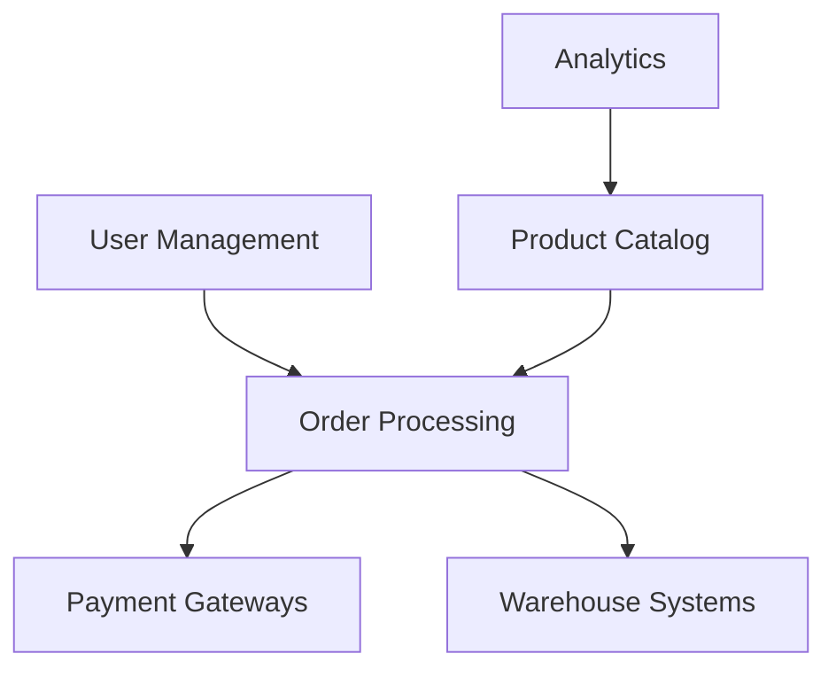

### **Architectural Evaluation for TechFlow Monolith-to-Microservices Migration**

---

## **1. System-Wide Impact Assessment**

### **Service Candidate Analysis**
| Component             | Extraction Candidate? | Rationale                                                                 | Data Consistency Needs          | Transaction Boundaries                     |
|-----------------------|-----------------------|---------------------------------------------------------------------------|---------------------------------|--------------------------------------------|
| **User Management**   | Yes                   | Independent domain; low cross-component dependencies.                     | Strong (user auth)              | Local to service; eventual for preferences |
| **Product Catalog**   | Yes                   | Statable; read-heavy; can use eventual consistency for recommendations.  | Eventual (recommendations)      | Strong for inventory; eventual for search  |
| **Order Processing**  | **Partial**           | High complexity; payment processing must remain tightly coupled with checkout. | Strong (payments)               | Split into: <br> - `Checkout Service` (strong) <br> - `Fulfillment Service` (eventual) |
| **Customer Service**  | Yes                   | Isolated I/O-bound workflows; async communication with tickets.           | Eventual                        | Per-ticket boundaries                      |
| **Analytics**         | Yes                   | Batch-processing; can run independently with event streams.               | Eventual                        | Event-driven pipelines                     |
| **Shared Utilities**  | **No**                | Core infrastructure; extraction would increase latency. Keep as shared library. | N/A                             | N/A                                        |

### **Key Insights**
- **Good Candidates**: User Management, Product Catalog, Customer Service, Analytics (independent domains, clear boundaries).
- **Remains Coupled**: 
  - Order Processing (payment validation requires strong ACID transactions).
  - Shared Utilities (database, caching, messaging) – refactor into **platform team libraries**.
- **Data Flow Impact**:
  - **Strong Consistency Required**: User auth, payment processing.
  - **Eventual Consistency Acceptable**: Recommendations, inventory updates, analytics.

---

## **2. Performance Implications Analysis**

### **Current vs. Projected Performance**

| Metric                     | Monolith (Current) | Microservices (Projected) | Change         | Risk Mitigation                              |
|----------------------------|--------------------|---------------------------|----------------|----------------------------------------------|
| **P50 Response Time**      | 200 ms             | 250–300 ms                | +25–50%        | Edge caching, CDN, async APIs                |
| **P95 Response Time**      | 800 ms             | 900–1.2s                  | +12.5–50%      | Service mesh (Istio), circuit breakers       |
| **P99 Response Time**      | 2.5 s              | 2–3.5s                    | +20% max       | Bulkheading, retries with backoff            |
| **Throughput**             | 5K req/min         | 50K req/min               | 10x            | Kubernetes HPA, auto-scaling groups          |
| **Database Bottlenecks**   | High (flash sales) | Reduced via sharding      | Resolved       | Database per service + read replicas         |
| **Memory Usage**           | 8GB/server         | 2–4GB/service             | Reduced        | Container resource limits                    |

### **Performance Optimization Strategies**
- **Network Latency**: 
  - Use **gRPC** for internal services (lower overhead vs REST).
  - **Service Mesh** (e.g., Istio) for observability and retries.
- **Data Locality**: 
  - **Embedded caches** (Redis) per service for hot data (e.g., inventory).
  - **CQRS** for product catalog (separates reads/writes).
- **Query Optimization**: 
  - **Materialized views** for analytics; **event sourcing** for order state.

---

## **3. Security Architecture Review**

### **New Attack Vectors & Mitigations**

| Vulnerability          | Risk Level | Mitigation Strategy                              | Compliance Impact (PCI DSS)         |
|------------------------|------------|--------------------------------------------------|-------------------------------------|
| **Service-to-Service Auth** | High      | **mTLS** (mutual TLS) via service mesh           | Required for inter-service calls    |
| **Data Leakage**       | Medium     | **Secret management** (Vault); **encryption at rest** per service | Encryption of PCI data in transit/storage |
| **API Governance**     | High       | **API Gateway** (Kong/Apigee) with rate limiting, JWT validation | Centralized payment tokenization    |
| **Network Exfiltration** | Critical  | **VPC peering**; **service mesh network policies** | Segmented PCI data networks         |
| **Insecure Deserialization** | Medium   | **Input validation** per service; **OWASP patches** | Validate payment payloads          |

### **Key Recommendations**
- **Centralized Identity**: Deploy **Keycloak/OIDC** for cross-service auth.
- **PCI Compliance**: 
  - Isolate payment processing in **dedicated VLAN**.
  - Use **tokenization** (e.g., Stripe) to avoid storing raw card data.
- **Zero Trust**: Strict **RBAC** per service; audit logs for all PCI-related flows.

---

## **4. Dependency and Data Flow Analysis**

### **Current Tight Coupling Map**


### **Proposed Service Boundaries**
| Service                | External Dependencies        | Data Ownership               | Consistency Strategy       |
|------------------------|------------------------------|------------------------------|----------------------------|
| **User Service**       | None (self-contained)         | Users, Roles, Preferences    | Strong (local DB)           |
| **Catalog Service**    | External search (Elasticsearch) | Products, Inventory          | Eventual (inventory updates via events) |
| **Order Service**      | Payment Gateways, Warehouse   | Orders, Payments             | Strong (local DB)          |
| **Customer Service**   | None                         | Tickets, Chat History        | Eventual (updates via events) |
| **Analytics Service**  | Event Streams                | Reporting DB (Data Warehouse)| Eventual                    |

### **Data Flow Optimization**
- **Event-Driven Architecture**: 
  - Use **Kafka** for async communication (e.g., inventory updates → catalog service).
  - **Saga Pattern** for distributed transactions (e.g., order placement → payment → fulfillment).
- **Data Duplication**: 
  - Replicate read-heavy data (e.g., product prices) into catalog service for fast access.
- **Avoid Shared DB**: Each service owns its DB schema; use **change data capture (CDC)** for sync.

---

## **5. Migration Strategy & Risk Assessment**

### **Phased Migration Plan (Strangler Fig Pattern)**

```mermaid
gantt
    title Migration Timeline (18 Months)
    dateFormat  YYYY-MM-DD
    section Phase 1: Foundation (Months 1-3)
    Infrastructure Setup          :a1, 2023-01-01, 3m
    Platform Team Training        :a2, after a1, 3m
    section Phase 2: Low-Risk Services (Months 4-6)
    User Service Extraction       :2023-04-01, 3m
    Catalog Service Extraction    :2023-05-01, 3m
    section Phase 3: Medium-Risk Services (Months 7-9)
    Customer Service Extraction   :2023-07-01, 3m
    Analytics Service Extraction  :2023-08-01, 3m
    section Phase 4: High-Risk Services (Months 10-12)
    Order Service Refactor        :2023-10-01, 4m
    Payment Subservice Extraction :2023-11-01, 3m
    section Phase 5: Optimization & Scaling (Months 13-18)
    Data Replication & CDC        :2023-13-01, 3m
    Performance Tuning             :2023-15-01, 3m
```

### **Risk Mitigation**
| Risk                      | Mitigation Strategy                          | Rollback Plan                     |
|---------------------------|---------------------------------------------|-----------------------------------|
| **Data Inconsistency**    | Dual-write with eventual consistency; Saga pattern | Revert to monolith DB snapshot    |
| **Service Interruption**  | Blue-green deployments; canary releases     | Switch traffic back to monolith  |
| **Performance Degradation** | Load testing pre-merge; performance budgets | Scale monolith temporarily        |
| **Team Skill Gaps**       | Dedicated training sprint; hire SRE experts | Pause migration; reinforce training |

---

## **6. Operational Complexity Evaluation**

### **Operational Overhead Comparison**

| Area                  | Monolith                          | Microservices (15-20 services)         | Mitigation Tools                     |
|-----------------------|-----------------------------------|----------------------------------------|---------------------------------------|
| **Monitoring**        | App-level metrics (Prometheus)    | **Distributed tracing** (Jaeger); **service mesh metrics** | Grafana dashboards, alerting rules   |
| **Logging**           | Centralized (ELK)                 | **Log aggregation** (Fluentd → Loki)  | Standardized JSON logs               |
| **Debugging**         | Direct stack traces               | **Distributed tracing** required       | Service mesh, correlation IDs        |
| **Deployment**        | Single pipeline (45 min)          | **CI/CD per service** (<5 min)        | ArgoCD/GitOps, shared pipeline library |
| **Team Structure**    | 25 devs (all in one team)         | **Platform team** (SRE) + **Product teams** (5-6 devs/service) | Conway’s Law alignment               |
| **Infrastructure**    | 12 servers                        | **Kubernetes cluster** (50+ nodes)     | Managed K8s (EKS/GKE)                 |

### **DevOps Tooling Requirements**
- **Infrastructure as Code**: Terraform for cloud resources.
- **Service Mesh**: Istio for traffic management, security, observability.
- **Observability Stack**: Prometheus + Grafana + Jaeger + Loki.
- **CI/CD**: Jenkins/GitLab CI with service-specific pipelines.

---

## **7. Alternative Architecture Recommendations**

### **Decision Framework: Microservices vs. Modular Monolith**

| Criterion              | Microservices                                     | Modular Monolith                          |
|------------------------|---------------------------------------------------|-------------------------------------------|
| **Scalability**        | ✅ Horizontal scaling per service                 | ❌ Limited vertical scaling               |
| **Team Autonomy**      | ✅ Teams own services (fast releases)             | ❌ Merge conflicts, blocking dependencies |
| **Deployment Speed**   | ✅ <10 min per service                           | ❌ 45 min full redeploy                   |
| **Uptime SLA**         | ✅ Isolation improves resilience                  | ❌ Single point of failure                |
| **Operational Overhead** | ❌ High (monitoring, networking)               | ✅ Low (single deployment)                |
| **Learning Curve**     | ❌ Steep (SRE skills required)                   | ✅ Current team expertise (Python)        |
| **Budget Fit**         | ✅ $2M over 18 months covers K8s + tools         | ✅ Lower initial cost                    |

### **Recommendation: Hybrid Approach**
1. **Migrate to Modular Monolith First** (Months 1-6): 
   - Break monolith into **well-defined modules** (packages) with clear interfaces.
   - Implement **domain-driven design (DDD)** boundaries.
   - Add **internal API gateway** for HTTP/gRPC calls between modules.
2. **Then Extract Services Incrementally** (Months 7-18): 
   - Target independent domains (User, Catalog, Analytics).
   - Retain shared utilities (database, messaging) as **platform libraries**.
   - Use **strangler fig** to replace monolith modules with services.

**Why Hybrid?**
- **Lower Risk**: Teams retain familiarity while adopting microservices incrementally.
- **Cost-Effective**: Avoids full K8s overhaul upfront; uses existing infrastructure.
- **Compliance**: Easier PCI segmentation by isolating payment service early.

---

### **Final Recommendations**

1. **Adopt Hybrid Strategy**:
   - **Phase 1 (0-6 months)**: Modularize monolith; implement DDD; add internal API gateway.
   - **Phase 2 (7-18 months)**: Extract 4-5 services (User, Catalog, Customer, Analytics) using strangler fig.

2. **Technology Stack**:
   - **Containerization**: Docker + Kubernetes (managed).
   - **Service Mesh**: Istio for security and observability.
   - **Event Streaming**: Kafka for async communication.
   - **Observability**: Prometheus, Grafana, Jaeger, Loki.

3. **Organizational Changes**:
   - Form **Platform Team** (4-5 SREs) to manage K8s, networking, monitoring.
   - Split dev team into **product squads** (4-6 devs/service).
   - Invest in **microservices training** (3-month bootcamp).

4. **Budget Allocation**:
   - **$800K**: Infrastructure (K8s clusters, monitoring tools).
   - **$500K**: Training and hiring (SREs, DevOps).
   - **$400K**: Tooling (service mesh, CI/CD pipelines).
   - **$300K**: Buffer for unexpected issues.

5. **Success Metrics**:
   - Reduce deployment time to **<10 minutes** within 9 months.
   - Achieve **99.9% uptime** by Q4 of Year 1.
   - Cut production incidents to **<5/month** by Month 12.

**Verdict**: Migrate to microservices **but via a hybrid, phased approach** to mitigate risk while leveraging current team strengths. Prioritize independent domains first and retain strong governance over shared platform components.