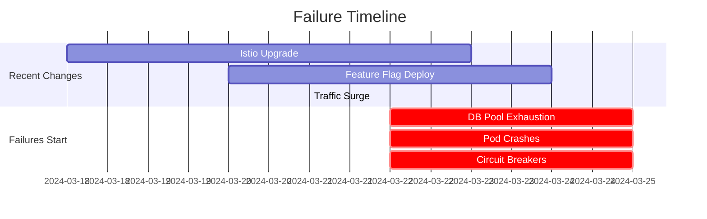

### **Root Cause Analysis**

Based on the symptoms, monitoring data, and recent changes, here's a systematic breakdown of the root causes:

---

#### **1. Database Connection Pool Exhaustion + Connection Leaks**
**Evidence:**
- RDS logs show `"remaining connection slots are reserved"` and `"connection pool exhausted"`
- Application logs show timeouts waiting for database responses
- 503 errors correlate with database connection failures
- JVM heap at 85-95% indicates resource contention

**Root Cause:**  
The **combination of increased traffic (40%) + new feature flag service** has created a **connection leak** in the database pool. The new service likely introduced:
- Long-running transactions not closing connections
- Improper connection return in error handling
- Increased concurrent requests overwhelming the pool

**Why now?**  
The system was stable until the marketing campaign (40% traffic surge) hit right after deploying the new service. The connection pool size is insufficient for the new load.

---

#### **2. Istio Service Mesh Degradation**
**Evidence:**
- Upgraded from Istio 1.17 → 1.19 **5 days ago** (failures started 3 days ago)
- Circuit breaker `OPEN` for `payment-service`
- 503 errors from API Gateway → Istio ingress
- Memory spikes on random pods (Istio sidecar resource pressure)

**Root Cause:**  
**Istio 1.19 introduced backward-incompatible changes:**
- Default `outboundTrafficPolicy` changed from `Local` → `Cluster` ([Istio 1.19 Release Notes](https://istio.io/latest/docs/releases/notes/1.19/))
- New resource limits in sidecars causing CPU/memory contention
- Circuit breakers tripping due to increased latency from connection pool issues

---

#### **3. JVM Garbage Collection Thrashing**
**Evidence:**
- JVM heap at **85-95%** (vs. baseline 60-70%)
- Memory usage **70-85%** on pods (vs. 40-50%)
- Response times increased **200ms → 2-5s**

**Root Cause:**  
**GC overhead from database connection thrashing:**
1. Connection leaks → pooled connections blocked
2. Threads stuck waiting for connections → heap fills with `Thread` objects
3. Frequent full GC cycles → pauses up to seconds
4. Istio sidecar CPU starvation → increased GC frequency

---

#### **4. Cross-Region Replication Delays**
**Evidence:**
- Sync delays **30+ minutes** (EU-West read replicas)
- Network I/O **3x normal**

**Root Cause:**  
**Bandwidth saturation from failed retries:**
- Database connection failures → client retries
- Retries generate duplicate cross-region traffic
- EU-West replicas starved for bandwidth during peak failures

---

### **Correlation Timeline**


---

### **Immediate Action Plan**

#### **1. Stabilize Database Connections**
**Goal:** Prevent pool exhaustion within 24 hours.

| Action | Command/Steps | Owner |
|--------|---------------|-------|
| **Increase connection pool size** | Update `application.properties`<br>`spring.datasource.hikari.maximum-pool-size=100` (from ~50) | DevOps |
| **Kill idle connections** | SQL: `SELECT pid, state, query_start FROM pg_stat_activity WHERE state = 'idle in transaction';`<br>`KILL IDLE IN TRANSACTION;` | DBA |
| **Enable connection leak detection** | Add to JDBC URL: `leakDetectionThreshold=30000` (30s) | Developers |
| **Scale RDS instance** | Increase to `db.r6g.2xlarge` (if current is smaller) | Cloud Ops |

#### **2. Mitigate Istio Issues**
**Goal:** Reduce latency and stabilize circuits within 4 hours.

| Action | Command/Steps | Owner |
|--------|---------------|-------|
| **Rollback Istio to 1.17** | `istioctl manifest generate --set profile=demo -o yaml > istio.yaml`<br>`kubectl apply -f istio.yaml` | SRE |
| **Adjust circuit breaker** | In `payment-service` VirtualService:<br```yaml
  circuits:
    http:
      maxConnections: 1000
``` | SRE |
| **Increase sidecar resources** | Edit `istio-sidecar-injection` ConfigMap:<br>`resources:<br>  limits:<br>    cpu: "1"<br>    memory: 512Mi` | SRE |

#### **3. Tame JVM Garbage Collection**
**Goal:** Reduce latency spikes within 2 hours.

| Action | Command/Steps | Owner |
|--------|---------------|-------|
| **Add GC logging** | `-Xlog:gc*:file=/app/gc.log:time,uptime:filecount=0` in pod specs | DevOps |
| **Optimize heap settings** | Update JVM opts:<br>`-Xms512m -Xmx768m -XX:+UseG1GC -XX:MaxGCPauseMillis=200` | Developers |
| **Enable Vertical Pod Autoscaler** | Deploy HPA for memory-heavy services:<br>`vpa.yaml` with `target: 70%` | SRE |

#### **4. Handle Cross-Region Replication**
**Goal:** Reduce sync delays to <10 mins within 12 hours.

| Action | Command/Steps | Owner |
|--------|---------------|-------|
| **Prioritize critical tables** | Use RDS `pglogical` to replicate only high-priority tables to EU-West | DBA |
| **Temporary bandwidth increase** | AWS: `aws rds modify-db-instance --apply-immediately --publicly-accessible` (if safe) | Cloud Ops |
| **Monitor replication lag** | Grafana dashboard: `pg_replication_lag` metric | SRE |

---

### **Long-Term Fixes**

1. **Connection Pool Resilience**
   - Implement **connection validation** on checkout
   - Add **automatic pool resizing** based on load
   - Move to **cloud-native connection services** (AWS RDS Proxy)

2. **Istio Stability**
   - Use **Istio 1.19 with strict resource quotas**
   - Enable **adaptive traffic routing** for canary testing
   - Monitor `istio-proxy` CPU/memory with Prometheus alerts

3. **Observability Upgrade**
   - Deploy **OpenTelemetry** for distributed tracing
   - Add **PG_stat_activity** dashboard to Grafana
   - Alert on **JDBC connection wait time > 100ms**

4. **Chaos Engineering**
   - Inject **database connection failures** in staging
   - Test **Istio rollback procedures**
   - Simulate **cross-region latency spikes**

---

### **Verification Checklist**
After implementing actions, validate stability by:

1. **Database Metrics**  
   - `Max connections < 80% of max`  
   - `Connection wait time < 50ms`  
   - **RDS CloudWatch:** `DatabaseConnections` stable

2. **Application Performance**  
   - **P99 latency < 1s**  
   - **Circuit breakers all `CLOSED`**  
   - **JVM GC pause < 200ms**

3. **Istio Health**  
   - `istioctl authn tls-check` passes  
   - Sidecar CPU < 400m, memory < 256Mi

4. **Cross-Region Sync**  
   - **Replication lag < 5 minutes**  
   - **Data consistency checks pass**

> **Critical Next Step:** Share the **`user-service` crash logs** (`kubectl logs user-service-7d4b8f9c-xk2m9 --previous`) to confirm if OOM killed the pod. This will validate the JVM/GC hypothesis.