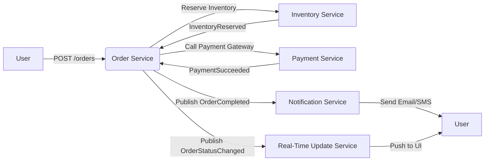
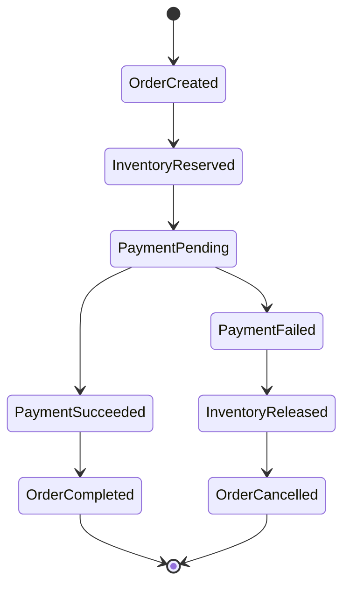

**Clarifying Questions**  

- What infrastructure are you currently running on (e.g., Kubernetes, VMs, serverless)?  
- Do you have an existing message broker beyond RabbitMQ (e.g., Apache Kafka, NATS) that could be used for high‑throughput events?  
- Are you able to introduce a service‑mesh (Istio/Linkerd) or a dedicated resilience library (Polly, Hystrix, Resilience4j)?  
- What are the latency/throughput targets for order placement and inventory checks during peak traffic?  
- Is a read‑only cache (Redis, Memcached) already in place, or can one be added?  
- Which front‑end framework will consume real‑time order updates (SPA, mobile app, etc.)?  
- Do you have existing observability stacks (Prometheus/Grafana, OpenTelemetry, ELK) or would you like to add them?  
- Are there any regulatory or compliance constraints that affect data consistency (e.g., financial reporting)?  
- Can the Product Service be split into separate *catalog* and *inventory* responsibilities, or must it stay monolithic?  

Answering these will help fine‑tune the proposed redesign, but the following outline can be applied regardless.

---

### Summary of Current Challenges  

| # | Issue | Root Cause |
|---|-------|------------|
| 1 | Order Service times out checking inventory | Synchronous HTTP call to Product Service under load |
| 2 | Failed payments leave inventory in an inconsistent state | No compensating action / eventual consistency gap |
| 3 | Users don’t get real‑time order status | UI polls REST endpoints only |
| 4 | System unavailable when Product Service fails | Tight coupling & lack of fallback |
| 5 | Unreliable notification delivery during peaks | RabbitMQ consumer overload, no retries / DLQ |

---

### High‑Level Redesign Overview  

1. **Introduce an explicit **Inventory Service** separate from the Product Catalog.**  
   - Keeps stock data close to the reservation logic.  
   - Allows caching, read‑replicas, and fast “reserve‑if‑available” checks.

2. **Adopt a **Saga/Orchestration pattern** for order placement.**  
   - Guarantees eventual consistency across Order, Inventory, Payment, and Notification.  
   - Provides compensating actions when a step fails.

3. **Add an **event bus** (Kafka or a scaled RabbitMQ topics) for asynchronous communication.**  
   - Decouples services, enables reliable retries, and supports idempotent consumers.

4. **Implement **circuit‑breaker, bulkhead, and fallback** patterns at the API‑Gateway / Order Service.**  
   - Prevents cascading failures when Inventory or Payment services are unhealthy.

5. **Expose **real‑time order status** via a dedicated WebSocket/Server‑Sent‑Events channel.**  
   - Push updates from the Notification Service (or a new Real‑Time Update Service) directly to the UI.

6. **Introduce **observability** (distributed tracing, metrics, health‑checks) and **resilience testing** (chaos engineering).**

---

### Service Decomposition & Responsibility Table  

| Service | Current Responsibility | Proposed Responsibility | New Patterns |
|---|---|---|---|
| **User Service** | Account management, authentication | Same + JWT issuance for API‑Gateway | OAuth2/JWT, rate‑limiting |
| **Product Catalog Service** | Product CRUD, basic inventory view | Read‑only product data (descriptions, pricing) | Cached reads, read‑replicas |
| **Inventory Service** *(new)* | – | Stock levels, reservation logic, release compensation | Redis cache, circuit‑breaker fallback, idempotent reserve command |
| **Order Service** | Order creation, payment call, basic status | Saga orchestrator: reserve inventory → call payment → emit events | Saga orchestration, retry with exponential back‑off, timeout |
| **Payment Service** *(external or internal)* | Payment gateway integration | Same, but expose result as event (PaymentSucceeded/PaymentFailed) | Idempotent webhook handling, circuit‑breaker |
| **Notification Service** | Email/SMS via RabbitMQ | Publish order‑status events, retry with DLQ, fallback to email‑only | Dead‑Letter Queue, retry policy, bulk‑send |
| **Real‑Time Update Service** *(new)* | – | WebSocket server broadcasting OrderStatusChanged events | Persistent connections, back‑pressure handling |
| **API Gateway** | Routing, auth | Central entry point, rate‑limiting, circuit‑breaker per downstream service | Envoy/ Istio, JWT validation, request throttling |
| **Event Bus** | RabbitMQ topic for notifications | Kafka topics (OrderCreated, InventoryReserved, PaymentResult, OrderCompleted) | Exactly‑once semantics (idempotent consumers), schema registry |

  

---

### Communication Patterns Table  

| Source | Target | Pattern | Message Type | Reliability |
|---|---|---|---|---|
| User Service | API Gateway | Synchronous HTTPS (REST) | API request | Circuit‑breaker at GW |
| API Gateway | Order Service | Synchronous HTTPS (REST) | OrderCreateRequest | Timeout + retry |
| Order Service | Inventory Service | Asynchronous command (Kafka topic `reserve-inventory`) | ReserveInventoryCommand | At‑least‑once, idempotent consumer |
| Inventory Service | Order Service | Asynchronous event (Kafka topic `inventory-reserved`) | InventoryReservedEvent | Idempotent handler |
| Order Service | Payment Service | Synchronous HTTPS (REST) | PaymentRequest | Circuit‑breaker, fallback to “payment‑pending” |
| Payment Service | Order Service | Asynchronous event (Kafka topic `payment-result`) | PaymentResultEvent (succeeded/failed) | DLQ + retry |
| Order Service | Notification Service | Asynchronous event (Kafka topic `order-completed`) | OrderCompletedEvent | Retry + DLQ |
| Notification Service | Real‑Time Update Service | Asynchronous event (Kafka topic `order-status-changed`) | OrderStatusChangedEvent | Fan‑out to WebSocket clients |
| Real‑Time Update Service | UI (WebSocket) | WebSocket push | OrderStatusUpdate | Persistent connection, back‑pressure |
| API Gateway | Monitoring Stack | Metrics & health checks | Prometheus scrape / OpenTelemetry | Reliable (internal) |

  

---

### Resilience Patterns per Service  

| Service | Pattern | Implementation | Fallback |
|---|---|---|---|
| **Order Service** | Circuit‑breaker for Inventory & Payment calls | Resilience4j / Hystrix, timeout = 2 s, failure‑ratio = 0.3 | Use cached inventory view + “limited stock” mode |
| | Bulkhead | Separate thread‑pool per downstream call | Graceful degradation – reject new orders if pool exhausted |
| | Retry with exponential back‑off | 3 attempts, jitter = 200 ms | Fail fast & emit compensating event |
| **Inventory Service** | Cache‑aside pattern (Redis) | Store current stock, invalidate on reservation | Serve from cache with “stale‑while‑revalidate” |
| | Read‑replica for catalog reads | MongoDB secondary | Continue serving product data even if primary is down |
| | Idempotent reserve command | Use reservation‑id to dedupe | Safe retry without double‑reservation |
| **Notification Service** | Dead‑Letter Queue (RabbitMQ) | Move failed messages to DLQ after 5 retries | Manual inspection / alternate email provider |
| | Bulk‑send with rate‑limiting | Batch emails per minute | Switch to email‑only if SMS provider fails |
| **API Gateway** | Rate‑limiting & throttling | Envoy rate‑limit filter (RPS per client) | Return HTTP 429, UI shows “try again later” |
| | Circuit‑breaker per downstream | Envoy outlier detection | Return cached fallback response (e.g., “service unavailable”) |
| **Event Bus** | Idempotent consumers | Track processed event IDs in DB | Guarantees no duplicate state changes |
| | Schema registry | Confluent Schema Registry | Prevent breaking changes across services |

  

---

### Real‑Time Order Status Updates  

- **WebSocket channel** hosted by the **Real‑Time Update Service**.  
- Upon receiving an `OrderStatusChangedEvent` from the **Notification Service**, the service pushes a minimal JSON payload to all subscribed UI connections.  
- UI subscribes per order‑id (or via user‑id for all active orders) using a secure WebSocket (`wss://`).  
- **Back‑pressure**: the service buffers up to 100 messages per client; older messages are dropped gracefully.  
- **Fallback**: if WebSocket disconnects, the UI falls back to polling the Order Service every 5 s (gradual degradation).

---

### Event‑Driven Flow Diagram  

*Failure paths (not drawn for brevity):*  
- If `C` cannot reserve, `B` publishes `InventoryNotAvailable` → UI shown “Out of stock”.  
- If `D` fails, `B` triggers a compensating `ReleaseInventory` event and publishes `OrderCancelled`.

---

### Order Status State Diagram  

---

### Implementation Roadmap (Phased Approach)

1. **Phase 1 – Observability & Baseline**  
   - Deploy Prometheus + Grafana, OpenTelemetry tracing.  
   - Add health‑check endpoints and circuit‑breaker metrics.  
   - Instrument current services with logging and distributed tracing.

2. **Phase 2 – Inventory Service & Cache**  
   - Extract inventory logic into a new microservice.  
   - Add Redis cache for stock levels and implement an idempotent `reserve` command.  
   - Introduce read‑replica for product catalog reads.

3. **Phase 3 – Event Bus & Saga Orchestration**  
   - Provision Kafka cluster (or upgrade RabbitMQ topics).  
   - Redesign Order Service to emit/consume events (`reserve-inventory`, `payment-result`).  
   - Implement saga state machine (orchestrator) with compensation on failure.

4. **Phase 4 – Resilience at the Edge**  
   - Configure API‑Gateway (Envoy/Istio) with circuit‑breakers, rate‑limiting, and retries.  
   - Add bulkhead isolation per downstream call in Order Service.  
   - Enable fallback to cached inventory when Inventory Service is down.

5. **Phase 5 – Real‑Time Updates**  
   - Build Real‑Time Update Service (Node.js + Socket.IO or Go + WS).  
   - Wire it to receive `order-status-changed` events from Notification Service.  
   - Update front‑end to subscribe via secure WebSocket and handle graceful fallback.

6. **Phase 6 – Chaos & Performance Testing**  
   - Run chaos experiments (netem latency, service outage, Kafka partition loss).  
   - Validate circuit‑breaker trips, retry policies, and compensation actions.  
   - Tune timeouts, back‑off, and cache TTL based on test results.

7. **Phase 7 – Monitoring & Alerting Refinement**  
   - Create alerts for circuit‑breaker trips, DLQ growth, and WebSocket disconnects.  
   - Add dashboards for order latency, inventory reservation success rate, and notification delivery.

---

### Additional Considerations  

- **Security** – Use mTLS between services (service‑mesh) and JWT issued by User Service for API‑Gateway validation.  
- **Schema Evolution** – Register Avro/Protobuf schemas in a schema registry; enforce backward compatibility.  
- **Data Consistency** – Leverage event sourcing for Order and Inventory if audit trails are required; otherwise, rely on saga compensation.  
- **Testing Strategy** –  
  - Contract tests for each service’s API (Pact).  
  - End‑to‑end integration tests using testcontainers (Kafka, Redis, DBs).  
  - Load testing with Locust/Gatling to verify circuit‑breaker thresholds.  
- **Deployment** – Kubernetes Deployments with Helm charts; use Helm values to toggle features (e.g., enable/disable circuit‑breaker).  
- **Compliance** – Ensure any personal data sent via notifications complies with GDPR/CCPA (prefer email over SMS for sensitive info).  
- **Cost** – Evaluate whether Kafka adds operational overhead vs. scaling RabbitMQ; consider managed offerings (Aiven, Confluent Cloud) if self‑hosted is a concern.

---

**Next Steps**  

1. Review the clarifying questions above and provide any constraints or preferences.  
2. Decide on the event‑bus technology (Kafka vs. scaled RabbitMQ).  
3. Choose a service‑mesh or resilience library for the API‑Gateway.  
4. Prioritize the phases based on your current pain points (e.g., start with Inventory Service if timeouts are critical).  

With this foundation, the platform will be able to handle peak traffic, recover gracefully from failures, and give users live visibility into their orders.